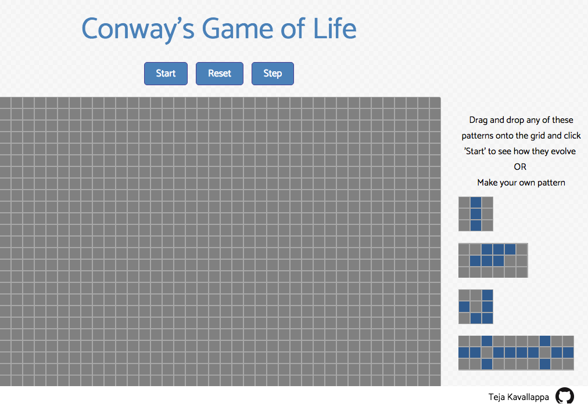
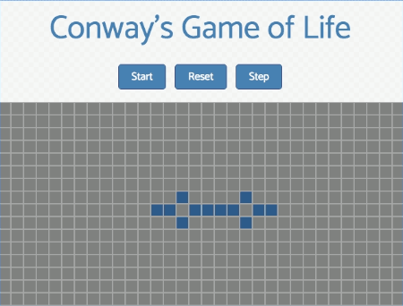

# Conway's Game of Life

Conway's game of life is an application built with HTML5 canvas and javascript, simulating a cellular automaton. Users choose an initial configuration of cells, and observe how the colony evolves according to certain rules.

Explore at [http://tejakavallappa.github.io/CellularAutomata/][live]

[live]: http://tejakavallappa.github.io/CellularAutomata/

## Welcome View:

[home-page]: (./images/landing_page1.png)

## Running pattern:

[landing-page]: /images/running_penta.gif

## Technical Details:

- [Conway's Game of Life] (https://en.wikipedia.org/wiki/Conway%27s_Game_of_Life) represents a complex system in which the constituent elements operate in parallel following a set of rules governing their relationships and thus exhibiting emergent behavior.
This implementation of Conway's Game of Life follows these rules:
+ Cells live on a grid; Each cell has a state ('alive' or 'dead'); Each cell has a neighborhood
+ If a cell is alive, it becomes dead if a) It has >= 4 alive cells in its neighborhood or b) It has < 2 alive cells in its neighborhood
+ A dead cell comes to life if it has 3 alive neighbors
+ A cell retains its state otherwise

## Features:

- HTML5 canvas with grid
- Two-dimensional array processing
- Usage of javascript asynchronous callbacks

##To-do:

- [ ] Allow users to select one of 5-6 starter colonies [oscillator, glider, etc]
- [ ] View all occupied cells at the end of a run
- [ ] View timer and nth-generation
- [ ] Each generation is displayed in a different color
- [ ] Allow growth of colonies with different sets of rules
